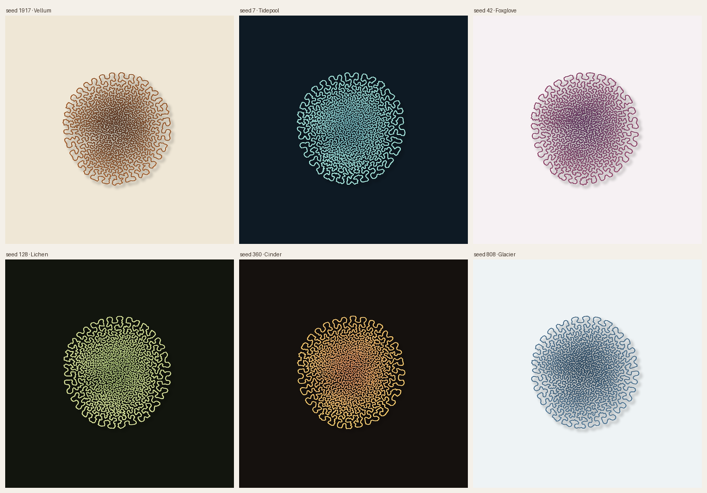
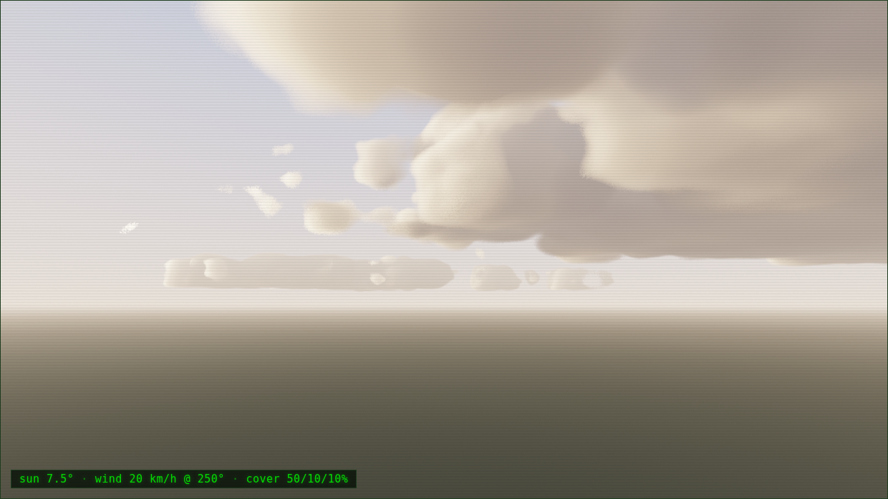
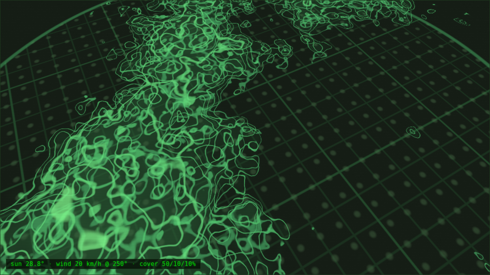

# Cloud Art

*A series of generative studies — each piece a different window onto the emergent, the infinite, or the living.*

---

## [Crenate](crenate.html)

*A boundary that outgrows its own skin.*



Grows a single closed filament that accretes new material faster than its area can hold, and so must buckle into nested, self-avoiding folds — the same quiet mechanism that crimps the margin of a leaf, convolutes a cortex, and ruffles a sea slug. Nothing is drawn. A boundary is *grown*, and then it stops, and what remains is the fossil of that growth: a crenate-edged organism, shaded by depth and mottled by the field that fed it.

**Technique:** Differential growth via a spatial-hash force simulation in p5.js. Per-node Perlin growth accumulators, Laplacian smoothing, cohesion/repulsion springs. Seeded and fully reproducible.

**Default seed 1917** — the year D'Arcy Thompson's *On Growth and Form* argued that living shape is the work of physical forces, not drafting.

**→ [Open Crenate](crenate.html)** | [Philosophy](philosophy/crenate.md)

---

## [Vermiculate](vermiculate.html)

*Two chemicals, an eternal dance.*

The Gray-Scott reaction-diffusion model: two chemicals A and B share a medium. B autocatalyzes (feeds on A and itself), while A is continuously replenished and B is continuously removed. Out of feed rate, kill rate, and diffusion alone — no blueprint, no instruction — the field discovers its own morphology: spots, stripes, mazes, spirals, labyrinthine convolutions. Every run from a new seed produces a new spatial arrangement of the same chemical grammar.

**Technique:** WebGL 2.0 ping-pong framebuffers. Gray-Scott equations in a GLSL compute shader, evaluated at 512×512 per step. Toroidal boundary conditions allow infinite zoom and pan through the living field. Click to disturb; scroll to zoom into the pattern's own intricate sub-structure.

**Default seed 1952** — the year Alan Turing's *The Chemical Basis of Morphogenesis* predicted that pattern could arise from diffusion and reaction alone.

**→ [Open Vermiculate](vermiculate.html)** | [Philosophy](philosophy/vermiculate.md)

---

## [Abyss](abyss.html)

*z → z² + c — where does it end?*

The Mandelbrot set, rendered in GLSL with smooth iteration-count coloring and orbit-trap depth layers. Its boundary is a fractal of Hausdorff dimension 2: a curve so convoluted it occupies area while having zero area. Navigate toward any feature and it never resolves — every zoom reveals new structure at the new scale, without end, because that is what the mathematics guarantees. Click anywhere in Mandelbrot mode to open the Julia set for that parameter, exploring the infinite catalogue of Julia set shapes indexed by the Mandelbrot set itself.

**Technique:** WebGL 2.0 fragment shader with per-pixel Mandelbrot/Julia iteration, Hubbard-Douady smooth escape count, orbit-trap ring and axis-proximity layers. Cosine palette with animatable color phase. Zoom range 1× to ~10⁶×.

**→ [Open Abyss](abyss.html)** | [Philosophy](philosophy/abyss.md)

---

## [Nubilous](nubilous.html)

*The sky, taught to happen again — and left running.*



Clouds are the oldest generative system: a noise field (humidity), a threshold rule (saturation), and external forces (wind shear, convection, sunlight) producing four billion years of non-repeating form. Nubilous runs that machine honestly — a raymarched volumetric atmosphere whose cloud base is derived from temperature and dewpoint, whose towers lean with the wind shear, whose light is Beer-Lambert extinction and forward scattering, not paint — and it runs *itself*. Open it and there is nothing but sky.

A **conductor** performs the weather: low-pressure systems cross a virtual map on a schedule set by the seed, and the classic frontal succession plays at the station you watch from — cirrus vanguard, thickening veil, nimbostratus rain, the cold front's squall, showery clearing, ridge calm — with the wind veering through each passage because it is computed from the actual pressure gradient. Convection is alive: individual cells rise, mature, rain out and collapse; a raining cell drops a cold pool whose gust front lifts daughter cells at its rim, and squall lines organize themselves out of three rules. Days pass in about twenty-five minutes; time slows to savor the fronts and hurries through the lulls. A **cinematographer** probes the density field for the action and works a shot grammar — horizon gaze, underside crawl, a rise through the deck into whiteout and out the top, a slow orbit of a growing tower.

And the sky keeps being *re-read*. The identical field drifts between renderings: **Synoptic** isopleth terraces; a **Transect** slice like a radar scan; **Flow**, where the clouds go invisible and each altitude's wind is combed into filaments; a **Census** of droplets sampled from the field and lit by the same sun; an **Engraving** whose hatching follows the wind; a phosphor **Terminal** glyph sky; a **Meteogram** writing the overhead column into a scrolling time–height score; and a **Taxonomy** overlay in which the machine names what it grows, in Luke Howard's Latin. Storms interrupt the abstractions and command the physical sky. Rare things are earned, never scripted: crepuscular rays through broken cover at low sun, the 22° halo when cirrus veils the sun, a rainbow when rain stands opposite, night lightning inside the cells, the moon at its true phase.



Given the network, the Earth itself becomes the random number generator: the piece roams to a real place every few minutes, fetches its actual sky from Open-Meteo — cloud cover by altitude, winds at four pressure levels, the local sun — and eases into it like a slow crossfade of climates, with a field-recording caption. Offline, the conductor plays on.

**Keys:** `i` telemetry · `` ` `` debug instrument (the full control panel) · `m` sound (wind, rain, and thunder that arrives late, from the distance of the flash) · `space` pause · drag to look (the director waits for you). URL: `?seed=` `?place=` `?roam=0` `?mute` `?debug`.

**Technique:** WebGL 2.0 raymarcher over GPU-baked tiling Perlin-Worley 3-D noise textures; dual-lobe Henyey-Greenstein phase, powder darkening, multi-octave light march; CPU cell entities rasterized into the density field; nine shader readings of one field; solar and lunar position from date and latitude; WebAudio weather score. One self-contained file. Seeded and reproducible — same seed, same weather history.

**Default seed 1802** — the year Luke Howard named the clouds, and the formless became a taxonomy.

**→ [Open Nubilous](nubilous.html)** | [Philosophy](philosophy/nubilous.md)

---

## Running

Open any `.html` file directly in a modern browser. No install, no server — each piece is fully self-contained. Crenate uses p5.js from a CDN; Vermiculate, Abyss and Nubilous require WebGL 2.0 (Chrome 56+, Firefox 51+, Safari 15+). Nubilous works fully offline with manual skies; live weather needs network access to the free, keyless open-meteo.com API.

## Files

```
crenate.html              differential growth (p5.js)
vermiculate.html          reaction-diffusion (WebGL 2)
abyss.html                fractal zoom (WebGL 2)
nubilous.html             volumetric weather (WebGL 2 + live data)
philosophy/
  crenate.md              algorithmic philosophy
  vermiculate.md          algorithmic philosophy
  abyss.md                algorithmic philosophy
  nubilous.md             algorithmic philosophy
gallery.png               Crenate contact sheet (6 seeds × 6 palettes)
preview-seed1917.png      Crenate hero render
preview-nubilous-sky.png       Nubilous sky-mode render
preview-nubilous-synoptic.png  Nubilous synoptic-mode render
```
